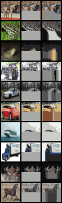
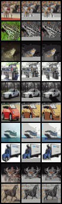

# Image GPT from scratch

This implementation is inspired by: https://github.com/teddykoker/image-gpt

Here are some example images completed by Image GPT model given a prompt (initial part of the image): 

1. Given only half of the initial image the completion looks as follows:

    

2. Given 80% of the image, the complete images looks as follows: 

    

We can notice that color has not been appropriately captured here. This is because of the granularity of the color clustering donr initially. We use only 16 clusters (for computational reasons) as opposed to using higher number as described in the paper. 